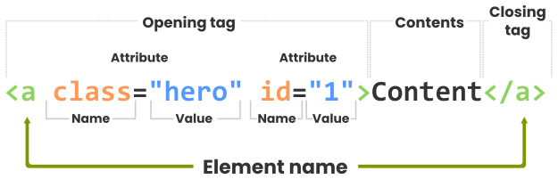

# Curso de HTML: Sintaxis HTML

[⏴ Volver al índice](../../README.md#índice-del-curso-html)

---

## 1. Introducción a la Sintaxis HTML

La **sintaxis de HTML** es el conjunto de reglas que definen cómo se estructura y se escribe el código HTML. Comprender la sintaxis es fundamental para crear páginas web bien formadas y funcionales. En esta sección, exploraremos los componentes clave de la sintaxis HTML, incluyendo elementos, etiquetas, atributos y comentarios.

---
## 2. Elementos HTML

Los **elementos HTML** son los bloques básicos que componen una página web. Cada elemento representa un tipo de contenido, como un párrafo, un encabezado, una imagen o un enlace.


### Estructura de un Elemento

Un elemento HTML está compuesto por tres partes principales:

1. **Etiqueta de apertura**: Indica el inicio del elemento.

2. **Contenido**: El texto o contenido que se muestra en la página.

3. **Etiqueta de cierre**: Indica el fin del elemento.

Ejemplo:

```html
<p>Este es un párrafo.</p>
```

  - `<p>`: Etiqueta de apertura.

  - `Este es un párrafo.`: Contenido.

  - `</p>`: Etiqueta de cierre.

### Elementos vacíos:

Algunos elementos no tienen contenido ni etiqueta de cierre. Estos se conocen como **elementos vacíos**.

Ejemplo:

```html

```

---
## 3. Etiquetas HTML

Las **etiquetas HTML** son los marcadores que definen el inicio y el fin de un elemento. Indican al navegador cómo debe interpretar y mostrar el contenido.

### Tipos de etiquetas:

  - **Etiquetas de apertura**: Indican el inicio de un elemento. Ejemplo: `<p>`.

  - **Etiquetas de cierre**: Indican el fin de un elemento. Ejemplo: `</p>`.

  - **Etiquetas vacías**: No tienen contenido ni etiqueta de cierre. Ejemplo: `<br>`.

**Ejemplo de un párrafo**:

```html
<p>Este es un párrafo.</p>
```


### Ejemplos comunes:

  - **Encabezados**: `<h1>`, `<h2>`, `<h3>`, etc.

  - **Párrafos**: `<p>`.

  - **Enlaces**: `<a>`.

  - **Imágenes**: ``.

  - **Listas**: `<ul>`, `<ol>`, `<li>`.


---

## 4. Atributos

Los **atributos** son propiedades que se añaden a las etiquetas para modificar su comportamiento o proporcionar información adicional.

### Estructura de un atributo:

Los atributos se colocan dentro de la etiqueta de apertura. Tienen un **nombre** y un **valor**, separados por un signo igual (`=`).

Ejemplo:

```html

```
        
  - `src`: Nombre del atributo.

  - `"imagen.jpg"`: Valor del atributo.

      


### Atributos comunes:

  - `src`: Especifica la fuente de un recurso (por ejemplo, una imagen).

  - `alt`: Proporciona un texto alternativo para una imagen (útil para accesibilidad).

  - `href`: Especifica la URL de un enlace.

  - `class`: Asigna una clase CSS para estilizar el elemento.

  - `id`: Asigna un identificador único al elemento.

### Atributos booleanos:

Los atributos booleanos no requieren un valor explícito. Su presencia activa la funcionalidad.

Ejemplo:

```html
<input type="checkbox" checked>
```
              
- `checked`: Atributo booleano que marca la casilla de verificación.

---

## 5. Comentarios en HTML

Los **comentarios** son notas que se añaden al código HTML para documentarlo o desactivar temporalmente una parte del código. No se muestran en el navegador.

### Sintaxis de los comentarios:

Los comentarios comienzan con  `<!--` y terminan con `-->`.

Ejemplo:

```html
<!-- Este es un comentario -->
<p>Este párrafo es visible.</p> 
<!-- <p>Este párrafo está comentado y no se mostrará.</p> -->
```

### Usos comunes de los Comentarios:

  - Documentar el código para facilitar su mantenimiento.

  - Desactivar temporalmente una parte del código sin eliminarlo.

⚠️ **Nota**: Los motores de búsqueda pueden leer los comentarios, por lo que no se deben usar para ocultar información sensible.

---

## 6. Ejemplo Completo de Sintaxis HTML

Aquí tienes un ejemplo que combina elementos, etiquetas, atributos y comentarios:

```html
<!DOCTYPE html>
<html lang="es">
<head>
    <meta charset="UTF-8">
    <meta name="viewport" content="width=device-width, initial-scale=1.0">
    <title>Ejemplo de Sintaxis HTML</title>
</head>
<body>
    <!-- Encabezado principal -->
    <h1>Bienvenido a mi página web</h1>

    <!-- Párrafo con un enlace -->
    <p>Visita mi <a href="https://www.ejemplo.com" target="_blank">sitio web</a>.</p>

    <!-- Imagen con texto alternativo -->
    

    <!-- Lista no ordenada -->
    <ul>
        <li>Elemento 1</li>
        <li>Elemento 2</li>
        <li>Elemento 3</li>
    </ul>

    <!-- Comentario: Este párrafo está desactivado -->
    <!-- <p>Este párrafo no se mostrará.</p> -->
</body>
</html>
```

---

## 7. Consejos para una Sintaxis Correcta

1. **Cierra todas las etiquetas**: Asegúrate de que cada etiqueta de apertura tenga su correspondiente etiqueta de cierre.

2. **Usa atributos correctamente**: Sigue las convenciones para nombres y valores de atributos.

3. **Mantén el código limpio**: Usa indentación y comentarios para mejorar la legibilidad.

4. **Valida tu código**: Usa herramientas como el [W3C Validator](https://validator.w3.org/) para asegurarte de que tu HTML esté bien formado.

---
## 8. Actividad Práctica

1. Crea un archivo HTML llamado `sintaxis.html`.

2. Escribe un código que incluya:

    - Un encabezado (`<h1>`).

    - Un párrafo (`<p>`) con un enlace (`<a>`).

    - Una imagen (``) con texto alternativo.

    - Una lista no ordenada (`<ul>`).

    - Un comentario que desactive un párrafo.

3. Abre el archivo en tu navegador para ver el resultado.

---
## 9. Diferencia entre Elementos y Etiquetas

| Concepto | Descripción                                                            |
| -------- | ---------------------------------------------------------------------- |
| Elemento | Incluye la etiqueta de apertura, el contenido y la etiqueta de cierre. |
| Etiqueta | Define el inicio y fin de un elemento, pero no incluye el contenido.   |

---
## 10. Tipos de Elementos en HTML
HTML5 clasifica los elementos en **bloque** e **inline**.

### Elementos de Bloque

  - Ocupan todo el ancho disponible y generan un salto de línea.

  - Se utilizan para estructurar el contenido principal.

  - Ejemplos: `<h1>` a `<h6>`, `<p>`, `<ul>`, `<ol>`, `<div>`.

Ejemplos:

```html
<h1>Encabezado</h1>
<p>Párrafo de texto.</p>
<ul>
    <li>Elemento de lista</li>
</ul>
<div>Contenedor</div>
```

### Elementos en Línea

  - No generan un salto de línea y solo ocupan el espacio necesario.

  - Se utilizan dentro de elementos de bloque para dar formato.

  - Ejemplos: `<a>`, ``, `<span>`.

Ejemplos:

```html
<a href="#">Enlace</a>
<span>Texto destacado</span>

```

---

## 11. Anidamiento de Elementos HTML

Los elementos HTML pueden estar **anidados**, lo que significa que un elemento puede contener otros elementos. Todos los documentos HTML consisten en elementos anidados.

**Ejemplo de anidamiento**:

```html
<html>
   <body>
     <p>Esto es un párrafo <strong>con texto destacado</strong>.</p>
   </body>
</html>
```

---

## 12.  Elementos Vacíos

Los elementos HTML sin contenido se denominan **elementos vacíos**. 

Ejemplo:

```html
<br> <!-- Salto de línea -->
```
En HTML5, no es necesario cerrar elementos vacíos, pero se recomienda hacerlo para una mejor validación:

```html
<br/>
```

## 13. Otras Consideraciones

- **No distingue entre mayúsculas y minúsculas**: `<P>` es lo mismo que `<p>`. Aunque HTML5 no requiere etiquetas en minúsculas, se recomienda usar siempre minúsculas.

- **Legibilidad**: Usa indentación y comentarios para mejorar la claridad del código.