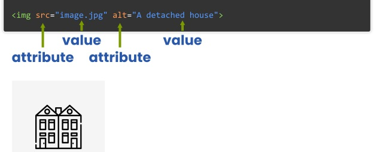

# Curso de HTML: Atributos y Valores en HTML

[⏴ Volver al índice](../../README.md#índice-del-curso-html)

---
## ¿Qué son los atributos en HTML?

Los **atributos** son características adicionales que se pueden agregar a las etiquetas HTML para definir su comportamiento o apariencia.

  - Se escriben dentro de la etiqueta de apertura.
  - Siempre tienen un nombre y un valor (`nombre="valor"`).
  - Algunos atributos son específicos de ciertas etiquetas, mientras que otros pueden aplicarse a múltiples elementos.
  
Ejemplo de atributo en una etiqueta `<a>`:

```html
<a href="https://www.ejemplo.com">Ir a Ejemplo</a>
```

Aquí, `href` es un atributo que indica el destino del enlace.


## Sintaxis de los atributos
La estructura de un atributo en HTML sigue este formato:

```html
<etiqueta atributo="valor">Contenido</etiqueta>
```

Ejemplo con múltiples atributos:

```html

```

### 📌 Reglas importantes:

  ✅ Los nombres de los atributos son insensibles a mayúsculas, pero es recomendable usar minúsculas.

  ✅ Los valores de los atributos deben estar entre comillas dobles (`
"" `), aunque en algunos casos pueden omitirse si no contienen espacios.

  ✅ No debe haber espacios entre el nombre del atributo, el signo `=` y el valor.

## Clasificación de los atributos
Los atributos en HTML se pueden clasificar en varias categorías:

### Atributos Globales

Se pueden usar en casi cualquier elemento HTML. Algunos ejemplos:

  - `id` → Identificador único para el elemento.

  - `class` → Nombre de una o varias clases para aplicar estilos CSS.

  - `style` → Define estilos CSS en línea.

  - `title` → Muestra un texto emergente al pasar el mouse.

  - `lang` → Especifica el idioma del contenido.

Ejemplo de atributos globales:

```html
<p id="parrafo1" class="texto-importante" style="color: blue;" title="Esto es un párrafo">Este es un párrafo.</p>
```

### Atributos Específicos
Son atributos que solo funcionan en ciertos elementos HTML.

#### ✅ Atributos de enlaces (`<a>`)

  - `href` → Especifica la URL del destino del enlace.
  
  - `target` → Controla cómo se abre el enlace (_self, _blank, _parent, _top).

  - `rel` → Define la relación entre el documento actual y el enlace.

```html
<a href="https://www.google.com" target="_blank" rel="noopener">Abrir Google en nueva pestaña</a>
```

#### ✅ Atributos de imágenes (``)

  - `src` → Especifica la ubicación de la imagen.

  - `alt` → Texto alternativo para accesibilidad y SEO.

  - `width` y `height` → Definen el tamaño en píxeles o porcentaje.

```html

```




#### ✅ Atributos de formularios (`<input>`, `<form>`)

  - `type` → Define el tipo de entrada (text, email, password, number).

  - `placeholder` → Muestra un texto de ayuda dentro del campo.

  - `required` → Indica que el campo es obligatorio.

```html
<input type="email" placeholder="Introduce tu correo" required>
```

### Atributos Booleanos
Son atributos que no requieren un valor explícito; su presencia indica un estado activado. Algunos ejemplos:

  - `disabled` → Deshabilita un elemento.

  - `checked` → Marca una casilla de verificación.

  - `readonly` → Restringe la edición de un campo de texto.

```html
<input type="checkbox" checked> Acepto los términos
```

### Atributos de Datos (`data-*`)
Permiten almacenar información personalizada en los elementos HTML, útil para JavaScript.

```html
<button data-producto-id="1234">Comprar</button>
```

En JavaScript se puede acceder con:

```javascript
let productoID = document.querySelector("button").dataset.productoId;
console.log(productoID); // 1234
```

### Uso correcto de múltiples atributos
Se pueden agregar múltiples atributos en una misma etiqueta, separándolos con un espacio.

Ejemplo:

```html
<input type="text" placeholder="Tu nombre" required>
```

Es incorrecto escribir:

❌ `<input type="text"placeholder="Tu nombre"required>` (falta de espacios)

### Mejores prácticas con atributos

✔️ Usar valores en minúsculas para mayor compatibilidad.

✔️ Utilizar comillas dobles (`""`) para los valores, aunque HTML5 permite omitirlas si no contienen espacios.

✔️ No abusar del atributo `style`, ya que es mejor aplicar estilos con CSS.

✔️ Incluir `alt` en imágenes para accesibilidad y SEO.

✔️ Usar `aria-*` para mejorar la accesibilidad en aplicaciones web avanzadas.

Ejemplo con buenas prácticas:

```html

```

## Buenas Prácticas
Minúsculas: Aunque HTML5 no requiere que los nombres de los atributos estén en minúsculas, es recomendable usarlas por consistencia.
Comillas: Siempre se deben usar comillas alrededor de los valores de los atributos. Esto es especialmente importante si el valor contiene espacios.

    <!-- Correcto -->
    <a href="https://kikopalomares.com/">
    <p title="Kiko Palomares">Texto</p>

### Resumen

| Atributo | Descripción                                                            | Ejemplo
| -------- | ---------------------------------------------------------------------- |---------
| `href` | Define la URL en un enlace	 | `<a href="https://ejemplo.com">`
| `src` | Indica la fuente de una imagen o video	   | ``
| `alt` | Texto alternativo para imágenes		   | ``
| `title` | Muestra un mensaje al pasar el cursor	   | `<p title="Este es un párrafo">Texto</p>`
| `id` | Identificador único	   | `<div id="contenedor">`
| `class` | Define clases para CSS	   | `<p class="importante">`
| `style` | Agrega estilos en línea	   | `<h1 style="color: red;">`
| `target` | Define cómo abrir un enlace	   | `<a target="_blank">`
| `checked` | Marca una casilla de verificación	   | `<input type="checkbox" checked>`
| `data-*` | Almacena datos personalizados	   | `<div data-id="123">`


### Conclusión
  Los atributos son una característica clave en HTML, permitiendo a los desarrolladores personalizar elementos con precisión. Son fundamentales para definir enlaces, imágenes, estilos y más, y se dividen en atributos globales y específicos. Seguir buenas prácticas, como usar minúsculas y comillas, es esencial para mantener la claridad y funcionalidad del código HTML.