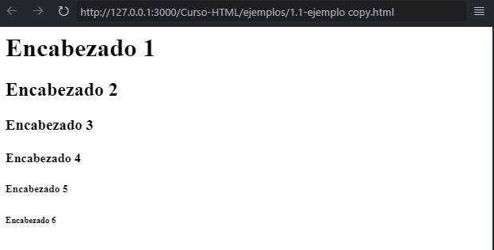

[⏴ Volver al índice](../../README.md#índice-del-curso-html)

# Encabezados HTML

---

## ¿Qué son los Encabezados HTML?

Los encabezados HTML son elementos que definen el título o encabezado de una sección en un documento HTML. Proporcionan estructura y jerarquía a la página, indicando la importancia de cada sección.

## Niveles de Encabezados

Existen seis niveles de encabezados, desde `<h1>` hasta `<h6>`, donde `<h1>` es el más importante y `<h6>` el menos importante. El nivel de encabezado se determina por el número en la etiqueta.

## Propósito de los Encabezados

- **Accesibilidad**: Ayudan a los usuarios a comprender la estructura del contenido.
- **SEO**: Los motores de búsqueda utilizan los encabezados para categorizar y entender el tema de la página, lo que puede mejorar la optimización para motores de búsqueda (SEO).

Es crucial usar los encabezados de manera adecuada y no abusar de ellos solo por motivos estéticos. Por ejemplo, no se debe usar `<h3>` como subtítulo de `<h1>` sin incluir un `<h2>` en medio, ya que esto puede confundir tanto a los usuarios como a los motores de búsqueda.

## Ejemplo de Encabezados

Los encabezados se definen con las etiquetas `<h1>` a `<h6>`.

    <h1>Encabezado 1</h1>
    <h2>Encabezado 2</h2>
    <h3>Encabezado 3</h3>
    <h4>Encabezado 4</h4>
    <h5>Encabezado 5</h5>
    <h6>Encabezado 6</h6>

[Archivo del ejemplo](../../ejemplos/1.5_ejemplo_1.html)

### Importancia de los Encabezados

Los motores de búsqueda utilizan los encabezados para indexar la estructura y el contenido de las páginas web.
Los usuarios a menudo hojean una página por sus encabezados, por lo que es importante utilizarlos para mostrar la estructura del documento.
Los encabezados `<h1>` deben usarse para los encabezados principales, seguidos de los encabezados `<h2>`, luego los `<h3>` menos importantes, y así sucesivamente.
Usa los encabezados HTML solo para encabezados; no los uses para hacer el texto más grande o en negrita.

### Desglose de Niveles de Encabezados

- `<h1>`: Encabezado principal de la página.
- `<h2>`: Subtítulo de `<h1>`, utilizado para secciones principales.
- `<h3>`: Subtítulo de `<h2>`, para subsecciones.
- `<h4>`: Subtítulo de `<h3>`, para títulos menos importantes.
- `<h5>`: Subtítulo de `<h4>`, para títulos aún menos importantes.
- `<h6>`: Encabezado más pequeño y menos importante.

### Consideraciones Finales

El nivel del encabezado debe reflejar la jerarquía del contenido, no su tamaño visual. Utilizar correctamente los encabezados mejora la accesibilidad y la usabilidad del sitio web.
